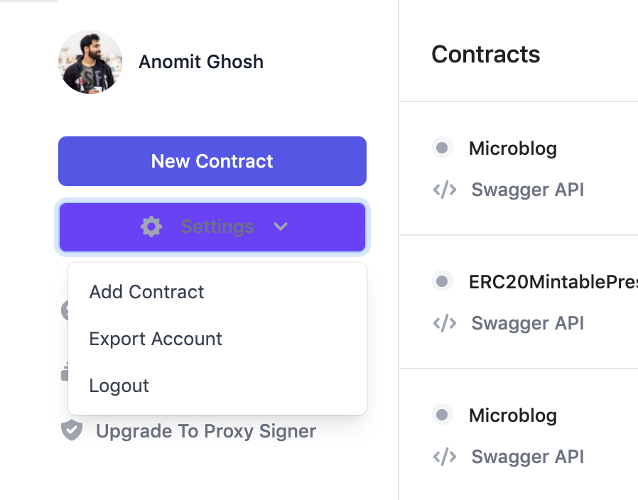
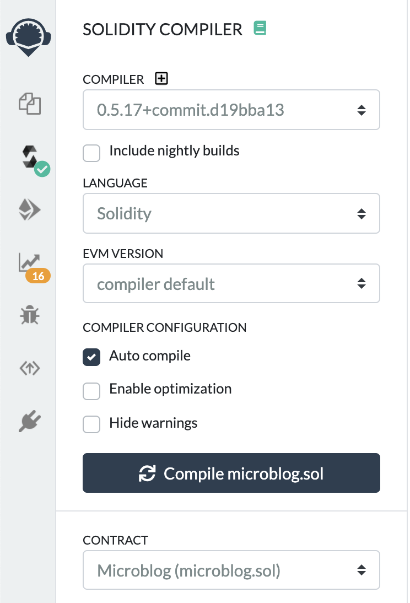
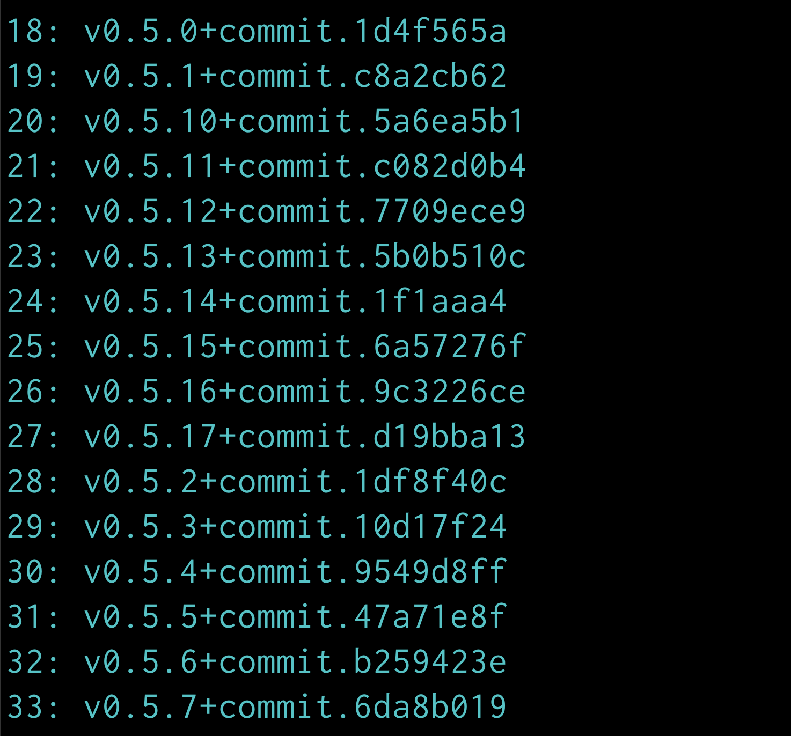
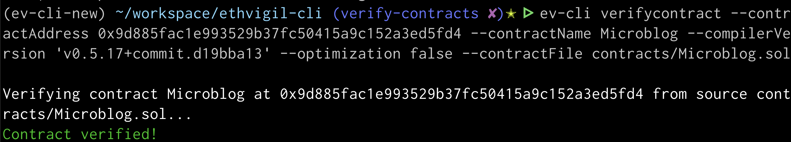

The guide will introduce you to the MaticVigil API endpoints with the help of a CLI tool that abstracts away the underlying HTTP requests. By the end of this guide, you shall be able to perform the following without a graphical frontend:
* sign up using your exclusive MaticVigil invite code
* access your account information on MaticVigil
* deploy a Solidity smart contract through the CLI tool

>If you wish to setup the CLI tool later, skip this section of the guide to use the web interface directly
>[⏩ ⏩ Using the Web Interface](web_gettingstarted.md)

## Recommended Installation

Download the [Linux](https://github.com/blockvigil/maticvigil-cli/releases/download/v0.3.1/mv-cli-linux.zip "Linux Zip File") or [Mac OSX](https://github.com/blockvigil/maticvigil-cli/releases/download/v0.3.1/mv-cli-osx.zip "Mac OSX Zip File") binary. You can unzip from a terminal with the following command.
`unzip /path/to/mv-cli-<platform>.zip`

Most people would keep mv-cli in their primary user folder or set an alias for easy command-line access.

`sudo cp /path/to/maticvigil-cli/mv-cli /usr/local/bin/`


## Advanced Installation (via pip)

>Until MaticVigil repos are public, you can install by downloading the binaries above.


```bash
# clone the git repo
git clone https://github.com/blockvigil/maticvigil-cli.git
cd maticvigil-cli
pip install -e .
```

## Setting up your account

There are a few handy paths you can take to setup or initialize your account on the MaticVigil CLI. Choose one of them from the following as it fits your scenario.

### ✅ Generate a new MaticVigil invite code and complete signup on CLI

Head to [MaticVigil](https://mainnet.maticvigil.com/?clisignup=true) to generate an invite code. Next you will need to run an init on the CLI tool.

```bash
mv-cli init
```

>If you do not have mv-cli in your path and/or calling it directly, you will need to prefix `./`

```bash
./mv-cli init
```


On the next prompt you will be asked for your invite code. The invite code should have been sent to the email address you used to register.

`Enter your invite code: <invite-code-goes-here>`

You should see something like the following

```
http://mainnet.maticvigil.com/api/signup
{"success":true,"data":{"status":"active","email":"swaroop@maticvigil.com"}}
Sign up succeeded...
Logging in with your credentials...
You have signed up and logged in successfully to MaticVigil
---YOU MIGHT WANT TO COPY THESE DETAILS TO A SEPARATE FILE---
===Private key (that signs messages to interact with MaticVigil APIs===
0xprivatekeyhexstring
===ETHEREUM hexadecimal address corresponding to above private key===
0xdFaFF6081f4544fEb76d213DEB2f9DC3C8453b6
```
On MaticVigil APIs, you are primarily idenitified by the above 160 bit address that we have generated locally for you.
`0xdFaFF6081f4544fEb76d213DEB2f9DC3C8453b6` in this case.

You can import the corresponding private key to a wallet solution like MetaMask.

>The keys are locally stored and MaticVigil does not have access to them. You can check the `~/.maticvigil/settings.json` file once init is complete.

>Feel free to skip to the section **[`Get your MaticVigil account information`](cli_gettingstarted.md#get-your-maticvigil-account-information)** if you have completed your account setup following the above instructions.

### ✅ Reuse your in-browser local wallet settings (No Metamask involved)

If you are already signed up [on the Web UI with a local wallet](web_gettingstarted.md#sign-up-with-invite-code), you can export a `settings.json` file that can be used to initialize the CLI.

Use the `Export Account` option from the `Settings` dropdown to download the `settings.json`



Next run the following command on your terminal to import these settings

```bash
mv-cli importsettings path/to/settings.json
```

>If you do not have mv-cli in your path and/or calling it directly, you will need to prefix `./`

```bash
./mv-cli importsettings path/to/settings.json
```

And that's it! Your CLI tool is now ready for further use.

## Get your MaticVigil account information

Once initialized, you can find information related to your MaticVigil account through the CLI tool.

```
mv-cli accountinfo

Contracts events fired to registered hooks: 	 {'usage': 0, 'limit': 1000}
=============

Registered integrations/hooks: 	 {'usage': 1, 'limit': 10}
=============

MaticVigil API key: 	 80340b2a-633b-4a33-898c-06055ee10a34
=============

REST API prefix: 	 https://mainnet.maticvigil.com/api/v0.1
=============

Contracts deployed/verified:
=============
Name: SignerControlBase
Address: 0x746254cb1888a0f073fca2cf397457fb3e54396f
--------------------
Name: ERC20Mintable
Address: 0xaec35285e21045bd4f159165015cc1f9df14c13e
--------------------
```

## Deploy a Solidity smart contract

We have included a couple of smart contracts written in Solidity in the code repo to help you test out their deployment right away.
You can find them under `contracts/` as `ERC20Mintable.sol` and `SignerControlBase.sol`

The syntax to deploy a contract through the CLI tool is:

```bash
mv-cli deploy <path-to-solidity-contract> \
 --contractName=<contract-name> \
 --constructorInputs='JSON representation of the constructor arguments'
```
>Currently MaticVigil API accepts Solidity files that import other Solidity files containing smart contracts and library code, **within the same directory**. For example, your imports must be of the form `import './SafeMath.sol'` denoting that `SafeMath.sol` is to be found in the same directory.

>We will soon add support for parsing relative import paths as well. Feel free to create a pull request against our [Github repo](https://github,com/blockvigil/maticvigil-cli) or chat with us on the [public discord channel](https://discord.gg/5GGVJyM) if you wish to contribute to solving this.

### ERC20 token contract example - ERC20Mintable.sol

```bash
mv-cli deploy contracts/ERC20Mintable.sol --contractName=ERC20Mintable --constructorInputs='["TestTokenName", "SYMB", 18]'

Contract ERC20Mintable deployed successfully
Contract Address: 0xaec35285e21045bd4f159165015cc1f9df14c13e
Deploying tx: 0x17a8009565731f45a1621905a7e85e84a6330b485ac3e7e450d90f126b6c3006
```
Observe that we are setting `--constructorInputs`. It is optional for contracts that have no constructor inputs programmed.

If you do not pass the `--constructorInputs` argument, you shall be prompted for the same.

```
mv-cli deploy contracts/ERC20Mintable.sol --contractName='ERC20Mintable'

Enter constructor inputs...
name(string): TestToken
symbol(string): TTK
decimals(uint8): 18
Contract ERC20Mintable deployed successfully
Contract Address: 0x9290b03870b0c4c99cc3c1e1dfcfa1ff789af6c0
Deploying tx: 0x699af417f4349f9e29d63dbc894874b5ae865fefe8e7a6bb2365339fab774211
```

### SignerControlBase.sol

This contract forms the base of [MaticVigil's Proxy+Signer Control contract](https://medium.com/blockvigil/signer-control-cum-proxy-smart-contract-a-look-at-ethvigils-latest-offering-9ad6c098c095). Without going into the logic of the contract, let us take a look at the constructor as written in the contract.

```
constructor (address[] memory _primaryOwners, address[] memory _secondaryOwners, uint _required_confirmations)
    public
```

#### ⚠️Passing JSON serialized constructor inputs to the CLI tool
>This section deals with passing constructor inputs via the CLI tool. It is always easier to do the same with code.
There can be compounding confusion since
* individual constructor parameters that are arrays are expected by the MaticVigil API to be encoded as strings
* the CLI tool itself accepts all the inputs as an array string.


An equivalent representation of the constructor inputs in JSON would look like
```json
[
  "[\"0x774246187E1E2205C5920898eEde0945016080Df\", \"0x902Abade63A5CB1b503Fe389aEA5906D18DAAF2b\"]",
  "[\"0x0228c246170f010C386f49e2dbc7aA999384B399\", \"0x5747Ca27b1031D8054cB9Cbc79F70CD2d9D2E204\"]",
  2
]
```

**Example to generate the JSON serialized string with Python follows**
```python
$ python
>>> import json
>>> _primary = ["0x774246187E1E2205C5920898eEde0945016080Df", "0x902Abade63A5CB1b503Fe389aEA5906D18DAAF2b"],  # primary owners
>>> _secondary = ["0x0228c246170f010C386f49e2dbc7aA999384B399", "0x5747Ca27b1031D8054cB9Cbc79F70CD2d9D2E204"] # secondary owners
>>> inputs = [
  json.dumps(_primary), json.dumps(_secondary), 2  # _required_confirmations
]
# write the entire list of arguments as a JSON serialized string into a file
>>> with open('c_inputs', 'w') as f:
        json.dump(inputs, f)
```
We dumped the JSON representation of the entire array of constructor inputs into a file, `c_inputs`.
We shall pass this next to the command line option of `--constructorInputs` in our call to deploy.


```bash
mv-cli deploy SignerControlBase.sol --contractName SignerControlBase --constructorInputs="$(< c_inputs )" --verbose=1

Got constructor inputs:
["[\"0x774246187E1E2205C5920898eEde0945016080Df\", \"0x902Abade63A5CB1b503Fe389aEA5906D18DAAF2b\"]", "[\"0x0228c246170f010C386f49e2dbc7aA999384B399\", \"0x5747Ca27b1031D8054cB9Cbc79F70CD2d9D2E204\"]", 2]
MaticVigil deploy response:
{"success":true,"data":{"contract":"0x746254cb1888a0f073fca2cf397457fb3e54396f","gas":"infinite","hash":"0xcb2cb6f036e01eb22707084f4780d731ee959a50fe6b6a562643cfa40f3d5e2f"}}
Contract SignerControlBase deployed successfully
Contract Address: 0x746254cb1888a0f073fca2cf397457fb3e54396f
Deploying tx: 0xcb2cb6f036e01eb22707084f4780d731ee959a50fe6b6a562643cfa40f3d5e2f
```

## Verifying a previously deployed contract

You may have already deployed contracts through a different interface, for eg, remix.ethereum.org and would like to operate on them through your current MaticVigil account. Alternatively, you may want to interact with other contracts on Matic Mainnet as well.

For this purpose, you will have to verify and add the contract to your account by specifying a few details, including the contract source code.

>To use the feature of verifying and adding contracts to MaticVigil, we assume that you have the source code and the address at which the contract has been deployed.

Here we have deployed the `Microblog.sol` contract found in the CLI example contracts directory, [`contracts/Microblog.sol`](https://github.com/blockvigil/maticvigil-cli/blob/master/contracts/Microblog.sol) through remix.ethereum.org , compiled with the Solidity compiler `v0.5.17+commit.d19bba13` and optimization flag **off**.



### Interactive mode

Run the verify command in interactive mode

```bash
mv-cli verifycontract -i
```

or

```bash
mv-cli verifycontract --interactive
```

Let us go over the input prompts for the interactive mode.

* `Contract address to be verified: 0x797ae7841281b6b3a72496b0193c91d150c7105d`

* `Contract name: Microblog`

* `Location of Solidity file: contracts/Microblog.sol`

Next you will have a paged list of compilers from which you have to choose the integer value against the compiler version which was used to compile the contract on https://remix.ethereum.org.




>In our case, the Solidity compiler `v0.5.17+commit.d19bba13` is at `27`. **Press `q` to exit the list and go back to the input prompt where you can enter this value**

The last input is regarding the optimization flag set originally at the time of compiling the deployed contract. Which is off in this case.

If you entered all the values at the prompts correctly, you should see a success message.


### Non-interactive mode (pass CLI arguments)

The same process as described above can be achieved from the command line by passing the right arguments against the parameters.

>You can run `mv-cli verifycontract --help` to learn about all the parameters

```bash
mv-cli verifycontract --contractAddress 0x9d885fac1e993529b37fc50415a9c152a3ed5fd4 \
--contractName Microblog \
--compilerVersion 'v0.5.17+commit.d19bba13' \
--optimization false \
--contractFile contracts/Microblog.sol
```



## Adding integrations
You can add integrations like webhooks/email notifications/slack notifications on a contract deployed via MaticVigil APIs.
* You can monitor
  * specific/all events being emitted on a contract
  * all transactions taking place on a contract
* You receive the relevant payloads like event topics or transaction input data

### Webhooks
To test webhooks, it is suggested to set up a webhook listener on a service like https://webhook.site
>MaticVigil supports only HTTPS enabled webhook endpoints

Register the webhook endpoint to get an ID by which the endpoint willl be identified
```
mv-cli registerhook 0xbbd8cda5503e1df2983f738ad131a2304528e3dd https://webhook.site/9facc063-beb1-483f-b24a-408375e5d1b6

{"success":true,"data":{"id":10}}
Succeeded in registering webhook with MaticVigil API...
MaticVigil Hook ID: 10
```
#### Subscribe to the `Transfer` and `Approval` events on the contract

```
mv-cli addhooktoevent 0xbbd8cda5503e1df2983f738ad131a2304528e3dd 10 Transfer,Approval

Registering | hook ID: 10 | events: ['Transfer', 'Approval'] | contract: 0xbbd8cda5503e1df2983f738ad131a2304528e3dd
{"success":true}
Succeeded in adding hook
 ```
#### Subscribe to all events, with a wildcard, *

```
mv-cli addhooktoevent 0xbbd8cda5503e1df2983f738ad131a2304528e3dd 10 '*'

Registering | hook ID: 10 | events: ['*'] | contract: 0xbbd8cda5503e1df2983f738ad131a2304528e3dd
{"success":true}
Succeeded in adding hook
```
#### Subscribe to all transactions sent to the contract
```
mv-cli enabletxmonitor 0xbbd8cda5503e1df2983f738ad131a2304528e3dd 10

{"success":true}
Succeded in adding hook to monitor all contract txs
```

## More CLI features
### Dump local settings
```
mv-cli dumpsettings

{'PRIVATEKEY': '0xprivatekeyhexstring', 'INTERNAL_API_ENDPOINT': 'https://mainnet.maticvigil.com/api', 'REST_API_ENDPOINT': 'http://localhost:9000/api/v0.1', 'MATICVIGIL_USER_ADDRESS': '0x40b93b89f89c674fB97db61d4b2D9CE2C2Cf6EB6', 'MATICVIGIL_API_KEY': '80340b2a-633b-4a33-898c-06055ee10a34'}
```
### Reset
If you wish to begin with a fresh slate, run the tool with the `reset` argument.
>You will lose all saved state, including the private key used to identify your account on MaticVigil.
You should either backup the information or request a new invite code

```bash
mv-cli reset

Do you want to reset the current MaticVigil CLI configuration and state? [y/N]:
```
### Backup settings and recover later

```bash
mv-cli dumpsettings > settings-backup.json

mv-cli reset

mv-cli importsettings setting-backup.json
```
