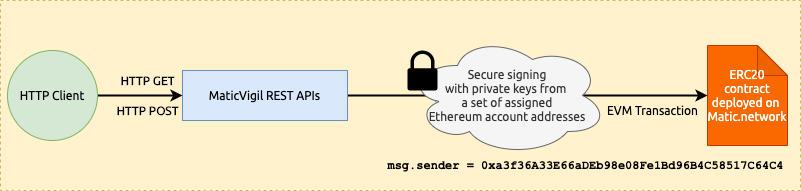
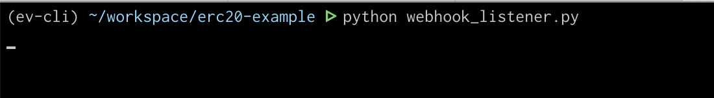
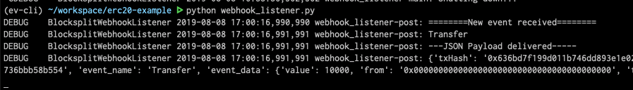
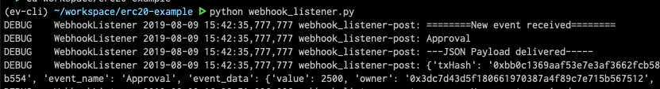
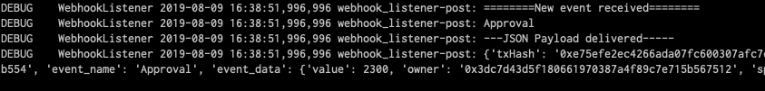
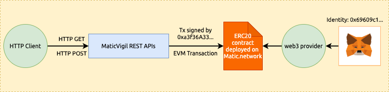
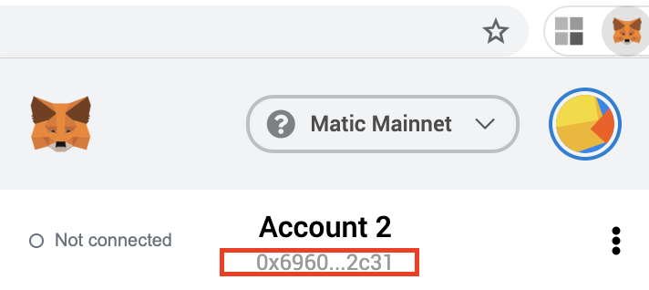
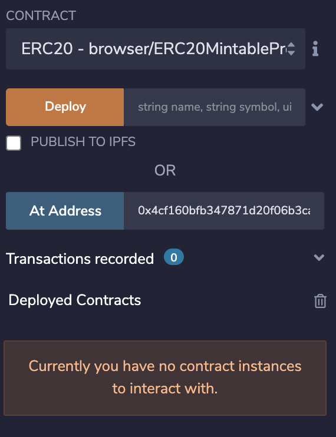
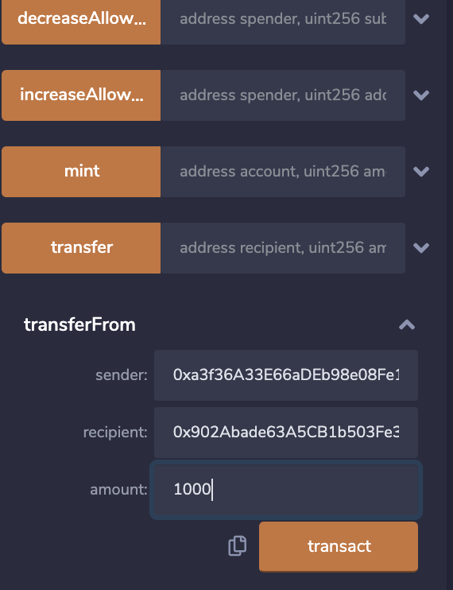
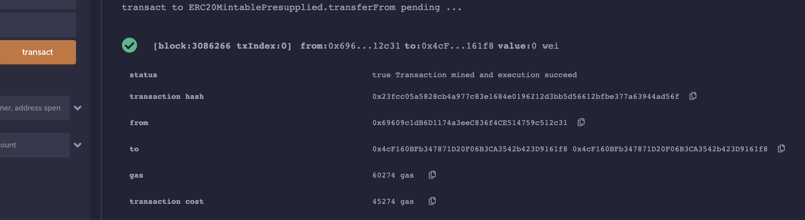

The guide will introduce you to working with an ERC20 token contract via the MaticVigil API endpoints.

>Please note that this guide deploys and interacts with a ERC20 contract on the Matic sidechain, and not the Ethereum main chain. Creation and transfer of tokens on the Matic sidechain will not have any effect on your asset holdings and positions in DeFi protocols that run on the Ethereum main chain.

These steps are also packaged into a CLI tool designed in Python for you to play around with an example ERC20 contract. [Visit the repo](https://github.com/blockvigil/maticvigil-api-usage-examples/tree/master/erc20) to clone and get hacking away.

Alternately, you can keep a note of
* the private key that identifies your user account uniquely on MaticVigil
* the API key uniquely alloted to your user account that allows you to make authenticated HTTP requests to the REST API endpoints generated for your smart contract

...and follow along the code examples as [standalone scripts](https://github.com/blockvigil/maticvigil-api-usage-examples/tree/master/erc20/standalone_scripts)

## Prerequisites
It is absolutely critical that you would have gone through at least one of our onboarding guides that will teach you the way MaticVigil handles user accounts, signing up, logging in, deploying contracts etc.

If you haven't, go check them out.
* [Getting started with the CLI tool](cli_gettingstarted.md)
* [Getting started with the Web UI](web_gettingstarted.md)

### To run the Python code snippets

Make sure you have [setup a clean virtualenv](https://akrabat.com/creating-virtual-environments-with-pyenv/) and run the following command inside the downloaded repo from Github.

```bash
pip3 install -r requirements.txt
```


## Before we begin

### A note about contract ownership

>This contract follows the standard implementations as found in the OpenZeppelin github repo, except for one little detail: we have removed the 'minter role' from the contract access control

Instead of

`contract ERC20Mintable is ERC20, MinterRole {`

we have

`contract ERC20Mintable is ERC20 {`

in the implementation of the final inherited token contract.

**This is done for a couple of specific reasons:**

* MaticVigil platform has its own design patterns for dealing with the Ethereum account address that should sign all transactions for a specific user. We will soon have a detailed doc dedicated to this specific topic of identity and key management.

* Now that there is no restriction based on ownership and roles, you can test out calls to and event logs on the **same contract instance** through
  * our APIs
  * via your own web3 code
  * Remix IDE

### A note about `msg.sender`

* In standard mode on our alpha/beta platforms, all REST API calls to MaticVigil APIs are converted to native Ethereum transactions that are signed by a fixed address.
  * For the Matic mainnet, this address happens to be `0xa3f36A33E66aDEb98e08Fe1Bd96B4C58517C64C4`.[ Here's a link to the transaction](https://explorer.matic.network/tx/0x0094f191c6ee29e7f307c82ff154ab0bec1d96e6751ece98b56d72b783e662ea/internal_transactions) from the [example `mint()` section.](erc20_example.md#minting) so you can verify that the above is indeed the address which signs transactions.


* Custom signers and proxying features will be introduced in a separate doc.

* For example, while calling the `approve()` method through our APIs, the `msg.sender` as seen on the contract will be the above address.



### Running the included CLI script to execute ERC20 functions

Install the required Python modules.

```bash
cd maticvigil-api-usage-examples/erc20
pip3 install -r requirements.txt
```

> You have to create a `settings.json` file for the command line script, [`cli.py`](https://github.com/blockvigil/maticvigil-api-usage-examples/blob/master/erc20/cli.py) to work. Make a local copy of the `settings.example.json` file included within the `erc20/` directory and name it `settings.json`

```bash
cp settings.example.json settings.json
```

In the `setttings.json` file, leave the `contractAddress` field to be filled after the [Deploy](#deploy-the-erc20-contract) step, and fill up the API endpoints, API key and the identity address associated with your MaticVigil account from `~/.maticvigil/settings.json`. The API endpoints have been filled below as an example for your convenience.

```JSON
{
  "development": {
    "contractAddress": "",
    "privatekey": "0xprivatekeyhexstring",
    "REST_API_ENDPOINT": "https://mainnet-api.maticvigil.com/v1.0",
    "INTERNAL_API_ENDPOINT": "https://mainnet.maticvigil.com/api",
    "MATICVIGIL_USER_ADDRESS": "0xaddr",
    "MATICVIGIL_API_KEY": "1212-1212-12-12"
  }
}
```

## Deploy the ERC20 contract

You can find the Solidity [source code here](https://github.com/blockvigil/maticvigil-api-usage-examples/blob/master/erc20/ERC20Mintable.sol).

You can deploy the contract [from the web UI](web_gettingstarted.md#deploy-a-solidity-smart-contract) or follow the code examples below.

<!--DOCUSAURUS_CODE_TABS-->

<!--Python-->
```py
from eth_account.messages import defunct_hash_message
from eth_account.account import Account
import requests
import json


def main():
    msg = "Trying to deploy"
    message_hash = defunct_hash_message(text=msg)
    private_key = "0xprivatekeyhexstring"
    constructor_inputs = ['My Token', 'SYMBOL', 18]
    sig_msg = Account.signHash(message_hash, private_key)
    with open('./ERC20Mintable.sol', 'r') as f:
        contract_code = f.read()
    deploy_params = {
        'msg': msg,
        'sig': sig_msg.signature.hex(),
        'name': 'ERC20Mintable',
        'inputs': constructor_inputs,
        'code': contract_code
    }
    print('Deploying with constructor arguments: ')
    print(constructor_inputs)
    # API call to deploy
    headers = {'accept': 'application/json', 'Content-Type': 'application/json'}
    api_endpoint = "https://mainnet.maticvigil.com/api"
    r = requests.post(api_endpoint + '/deploy', json=deploy_params, headers=headers)
    rj = r.json()
    print('Deployed contract results')
    print(rj)


if __name__ == '__main__':
    main()
```
<!--END_DOCUSAURUS_CODE_TABS-->

**Equivalent command for the [CLI tool included](https://github.com/blockvigil/maticvigil-api-usage-examples/blob/master/erc20/cli.py)**
```bash
python cli.py deploy

Contract address was not supplied in configuration
Enter the list of constructor inputs:
["MyTOKEN", "MT", 18]
Deploying with constructor arguments:
['MyTOKEN', 'MT', 18]
Deployed contract results
{'success': True, 'data': {'contract': '0xa6fe1ec95bb54596e3f05b734769f80e1cb62457', 'gas': 'infinite', 'txhash': '0xd9ea9fadce9ce0e275cc06d40e4caf0454f17b2bd6807122dd56e39e86b923e8', 'hash': '0xd9ea9fadce9ce0e275cc06d40e4caf0454f17b2bd6807122dd56e39e86b923e8'}}
Copy the contract address into settings.json
```

## Setup a webhook integration

We will set this up before we proceed any further with sending transactions to the ERC20 contract. Most of the transactions will generate multiple events and it would be nice to see a live update of the events being emitted on the Matic mainnet.

### Launch the bundled webhook listener
This will launch a server locally on the port 5554.
In the next section, we are going to open up a tunnel to it so that it is accessible remotely to deliver event data payloads.

Find the file `webhook_listener.py` [here](https://github.com/blockvigil/maticvigil-api-usage-examples/blob/master/erc20/webhook_listener.py).

```bash
python webhook_listener.py
```

### Launch ngrok
[ngrok](https://dashboard.ngrok.com/signup) is a free service to expose your local web server and quickly test out webhook integrations. Click on the link above to download and setup the tool if you don't have it already.

Then open a tunnel to port 5554, where the local webhook listner is running.

```bash
./ngrok http 5554
```

You will see a screen like the following:


Copy the HTTPS forwarding link, `https://c019aae8.ngrok.io` in this case.

### Register ngrok endpoint as webhook
Now we register the ngrok link from above as a webhook endpoint. This returns us a ID for this endpoint against which event data and other integrations can be configured.

<!--DOCUSAURUS_CODE_TABS-->

<!--Python-->

```py
from eth_account.messages import defunct_hash_message
from eth_account.account import Account
import requests


def main():
    contract = "0xcontractAddress"
    api_key = '1122-122-23443-1133'
    headers = {'accept': 'application/json', 'Content-Type': 'application/json',
               'X-API-KEY': api_key}
    private_key = "0xprivatekeyhexstring"
    api_endpoint = "https://mainnet.maticvigil.com/api"
    msg = 'dummystring'
    message_hash = defunct_hash_message(text=msg)
    sig_msg = Account.signHash(message_hash, private_key)
    method_args = {
        "msg": msg,
        "sig": sig_msg.signature.hex(),
        "key": api_key,
        "type": "web",
        "contract": contract,
        "web": "https://randomstring.ngrok.io"
    }
    r = requests.post(url=f'{api_endpoint}/hooks/add', json=method_args, headers=headers)
    print(r.text)
    if r.status_code == requests.codes.ok:
        r = r.json()
        if not r['success']:
            print('Failed to register webhook with MaticVigil API...')
        else:
            hook_id = r["data"]["id"]
            print('Succeeded in registering webhook with MaticVigil API...')
            print(f'MaticVigil Hook ID: {hook_id}')
    else:
        print('Failed to register webhook with MaticVigil API...')


if __name__ == '__main__':
    main()
```
<!--END_DOCUSAURUS_CODE_TABS-->

**Equivalent ERC20 CLI tool command**
```bash
python cli.py registerhook https://c019aae8.ngrok.io

{"success":true,"data":{"id":10}}
Succeeded in registering webhook with MaticVigil API...
MaticVigil Hook ID: 10
```

### Setup the endpoint to receive event data
We are now going to ask the MaticVigil platform to send us the data associated with events `Transfer` and `Approval` whenever they are emitted.

<!--DOCUSAURUS_CODE_TABS-->

<!--Python-->
```py
from eth_account.messages import defunct_hash_message
from eth_account.account import Account
import requests


def main():
    contract = "0xcontractAddress"
    api_key = '1122-122-23443-1133'
    headers = {'accept': 'application/json', 'Content-Type': 'application/json',
               'X-API-KEY': api_key}
    private_key = "0xprivatekeyhexstring"
    api_endpoint = "https://mainnet.maticvigil.com/api"
    events_to_be_registered_on = ['Approval', 'Transfer']
    hook_id = 12  # hook ID as registered on MaticVigil
    msg = 'dummystring'
    message_hash = defunct_hash_message(text=msg)
    sig_msg = Account.signHash(message_hash, private_key)
    method_args = {
        "msg": msg,
        "sig": sig_msg.signature.hex(),
        "key": api_key,
        "type": "web",
        "contract": contract,
        "id": hook_id,
        "events": events_to_be_registered_on
    }
    headers = {'accept': 'application/json', 'Content-Type': 'application/json'}
    print(f'Registering | hook ID: {hook_id} | events: {events_to_be_registered_on} | contract: {contract}')
    r = requests.post(url=f'{api_endpoint}/hooks/updateEvents', json=method_args,
                      headers=headers)
    print(r.text)
    if r.status_code == requests.codes.ok:
        r = r.json()
        if r['success']:
            print('Succeeded in adding hook')
        else:
            print('Failed to add hook')
            return
    else:
        print('Failed to add hook')
        return


if __name__ == '__main__':
    main()
```
<!--END_DOCUSAURUS_CODE_TABS-->

**Equivalent ERC20 CLI tool command**
```bash
python cli.py addhooktoevent 10 Transfer,Approval

Registering | hook ID: 10 | events: ['Transfer', 'Approval'] | contract: 0x4cf160bfb347871d20f06b3ca3542b423d9161f8
{"success":true}
Succeeded in adding hook
```

## Working with the ERC20 Interface

```
interface ERC20 {
  function totalSupply() external view returns (uint256);
  function balanceOf(address who) external view returns (uint256);
  function transfer(address to, uint256 value) external returns (bool);
  function allowance(address owner, address spender) external view returns (uint256);
  function transferFrom(address from, address to, uint256 value) external returns (bool);
  function approve(address spender, uint256 value) external returns (bool);

  event Approval(address indexed owner, address indexed spender, uint256 value);  
  event Transfer(address indexed from, address indexed to, uint256 value);
}
```
We are going to work with the methods as specified by the interface.

### Minting

If you check the total supply of tokens of the contract right after deployment, you will find it to be 0.
<!--DOCUSAURUS_CODE_TABS-->

<!--Python-->
```py
import requests


def main():
    contract_address = "0xcontractAddress"
    api_key = '1122-122-23443-1133'
    headers = {'accept': 'application/json', 'Content-Type': 'application/json',
               'X-API-KEY': api_key}
    rest_api_endpoint = 'https://mainnet-api.maticvigil.com/v0.1'
    method_api_endpoint = f'{rest_api_endpoint}/contract/{contract_address}/totalSupply'
    r = requests.get(url=method_api_endpoint, headers=headers)
    print(r.text)


if __name__ == '__main__':
    main()
```
<!--END_DOCUSAURUS_CODE_TABS-->

**Equivalent ERC20 CLI tool command**
```bash
python cli.py totalsupply

{"success": true, "data": [{"uint256": 0}]}
```

This is a good starting point. Let us mint a bunch of tokens and 'airdrop' to an address. This also increases the total supply of tokens.

<!--DOCUSAURUS_CODE_TABS-->

<!--Python-->

```py
import requests


def main():
    contract_address = "0xcontractAddress"
    api_key = '1122-122-23443-1133'
    rest_api_endpoint = 'https://mainnet-api.maticvigil.com/v0.1'
    method_args = {'account': '0x69609c1dB6D1174a3eeC836f4CE514759c512c31', 'amount': 10000}
    headers = {'accept': 'application/json', 'Content-Type': 'application/json', 'X-API-KEY': api_key}
    method_api_endpoint = f'{rest_api_endpoint}/contract/{contract_address}/mint'
    print('Calling mint()\n........')
    print(f'Contract: {contract_address}')
    print(f'Method arguments:\n===============\n{method_args}')
    r = requests.post(url=method_api_endpoint, json=method_args, headers=headers)
    print(r.text)


if __name__ == '__main__':
    main()
```
<!--END_DOCUSAURUS_CODE_TABS-->

**Equivalent ERC20 CLI tool command**

```bash
python cli.py mint 0x69609c1dB6D1174a3eeC836f4CE514759c512c31 10000

Calling mint()
........
Contract: 0x4cf160bfb347871d20f06b3ca3542b423d9161f8
Method arguments:
===============
{'account': '0x69609c1dB6D1174a3eeC836f4CE514759c512c31', 'amount': '10000'}
{"success": true, "data": [{"txHash": "0xTransactionHash"}]}
```

>Remember the [webhook setup](erc20_example.md#setup-a-webhook-integration) we did in the earlier section? It should deliver an update on an emitted event, similar to this



You can refer to the previous section on checking the total supply to verify the effects of the minting process.

### balanceOf

Check the tokens allotted to any Ethereum address on this contract instance. Corresponds to the method `function balanceOf(address who) external view returns (uint256);` specified in the standard ERC20 interface.

<!--DOCUSAURUS_CODE_TABS-->

<!--Python-->

```py
import requests


def main():
    contract_address = "0xcontractAddress"
    api_key = '1122-122-23443-1133'
    headers = {'accept': 'application/json', 'Content-Type': 'application/json',
               'X-API-KEY': api_key}
    rest_api_endpoint = 'https://mainnet-api.maticvigil.com/v0.1'
    account= '0x69609c1dB6D1174a3eeC836f4CE514759c512c31'
    method_api_endpoint = f'{rest_api_endpoint}/contract/{contract_address}/balanceOf/{account}'
    r = requests.get(url=method_api_endpoint, headers=headers)
    print(r.text)


if __name__ == '__main__':
    main()

```
<!--END_DOCUSAURUS_CODE_TABS-->

**Equivalent ERC20 CLI tool command**
```bash
python cli.py balanceof 0x69609c1dB6D1174a3eeC836f4CE514759c512c31
{"success": true, "data": [{"uint256": 30000}]}
```

### Approve

The ERC20 standard allows a spender account to spend an allowed number of tokens on behalf of `msg.sender`.

`approve(address spender, uint256 value)` is the relevant method where this feature is implemented.

>In the smart contract included in this example, this approves `spender` to spend `value` tokens at most on behalf of the account address of `msg.sender` i.e. the account that calls approve()
See important notes below for more knowledge.

[Refer to the section on `msg.sender`](erc20_example.md#a-note-about-msgsender) to get reacquainted with the identity of `msg.sender` when calling MaticVigil APIs in standard mode.

The following example approves an account `0x69609c1dB6D1174a3eeC836f4CE514759c512c31` to transfer at most `1000` tokens on behalf of `0xa3f36A33E66aDEb98e08Fe1Bd96B4C58517C64C4 `.

<!--DOCUSAURUS_CODE_TABS-->

<!--Python-->
```py
import requests


def main():
    contract_address = "0xcontractAddress"
    api_key = '1122-122-23443-1133'
    rest_api_endpoint = 'https://mainnet-api.maticvigil.com/v0.1'
    method_args = {'spender': '0x69609c1dB6D1174a3eeC836f4CE514759c512c31', 'value': 1000}
    headers = {'accept': 'application/json', 'Content-Type': 'application/json', 'X-API-KEY': api_key}
    method_api_endpoint = f'{rest_api_endpoint}/contract/{contract_address}/approve'
    print('Calling approve()\n........')
    print(f'Contract: {contract_address}')
    print(f'Method arguments:\n===============\n{method_args}')
    r = requests.post(url=method_api_endpoint, json=method_args, headers=headers)
    print(r.text)


if __name__ == '__main__':
    main()
```
<!--END_DOCUSAURUS_CODE_TABS-->

**Equivalent ERC20 CLI tool command**
```bash
python cli.py approve 0x69609c1dB6D1174a3eeC836f4CE514759c512c31 1000

Calling approve()
........
Contract: 0x4cf160bfb347871d20f06b3ca3542b423d9161f8
Method arguments:
===============
{'spender': '0x69609c1dB6D1174a3eeC836f4CE514759c512c31', 'value': '1000'}
{"success": true, "data": [{"txHash": "0xTransactionHash"}]}
```

The webhook listener should have received a JSON payload corresponding to the `Approval` event being emitted.


>From a security standpoint, the 'approve' feature carries serious vulnerabilties. We encourage you to research on the same.
### Check allowance
The ERC20 contract interface specifies a method `function allowance(address owner, address spender) external view returns (uint256);` This makes it easy for us to check on a dApp whether we should proceed with a transfer if it exceeds the configured allowance.

We will achieve the same via MaticVigil API.

>Observe that the REST endpoint exposed via MaticVigil for this specific method is `/<contractaddress>/allowance/{owner}/{spender}` . We are accessing the information as if it were a resource of allowance mappings between owners and spenders.

<!--DOCUSAURUS_CODE_TABS-->

<!--Python-->

```py
import requests


def main():
    contract_address = "0xcontractAddress"
    api_key = '1122-122-23443-1133'
    headers = {'accept': 'application/json', 'Content-Type': 'application/json',
               'X-API-KEY': api_key}
    rest_api_endpoint = 'https://mainnet-api.maticvigil.com/v0.1'
    owner = '0xa3f36A33E66aDEb98e08Fe1Bd96B4C58517C64C4 '
    spender = '0x69609c1dB6D1174a3eeC836f4CE514759c512c31'
    method_api_endpoint = f'{rest_api_endpoint}/contract/{contract_address}/allowance/{owner}/{spender}'
    r = requests.get(url=method_api_endpoint, headers=headers)
    print(r.text)


if __name__ == '__main__':
    main()
```
<!--END_DOCUSAURUS_CODE_TABS-->

**Equivalent ERC20 CLI tool command**
```bash
python cli.py allowance 0xa3f36A33E66aDEb98e08Fe1Bd96B4C58517C64C4  0x69609c1dB6D1174a3eeC836f4CE514759c512c31

{"success": true, "data": [{"uint256": 1000}]}
```

### Increase allowance

The method corresponding to this is `function increaseAllowance(address spender, uint256 addedValue) public returns (bool)`

This is functionally [similar to `approve()`](erc20_example.md#approve) but mitigates certain security vulnerabilities exposed by it.  


<!--DOCUSAURUS_CODE_TABS-->

<!--Python-->

```py
import requests


def main():
    contract_address = "0xcontractAddress"
    api_key = '1122-122-23443-1133'
    rest_api_endpoint = 'https://mainnet-api.maticvigil.com/v0.1'
    method_args = {'spender': '0x69609c1dB6D1174a3eeC836f4CE514759c512c31', 'addedValue': 1000}
    headers = {'accept': 'application/json', 'Content-Type': 'application/json', 'X-API-KEY': api_key}
    method_api_endpoint = f'{rest_api_endpoint}/contract/{contract_address}/increaseAllowance'
    print('Calling increaseAllowance()\n........')
    print(f'Contract: {contract_address}')
    print(f'Method arguments:\n===============\n{method_args}')
    r = requests.post(url=method_api_endpoint, json=method_args, headers=headers)
    print(r.text)


if __name__ == '__main__':
    main()
```
<!--END_DOCUSAURUS_CODE_TABS-->

**Equivalent ERC20 CLI tool command**
```bash
python cli.py increaseallowance 0x69609c1dB6D1174a3eeC836f4CE514759c512c31 2000

Calling increaseAllowance()
........
Contract: 0x4cf160bfb347871d20f06b3ca3542b423d9161f8
Method arguments:
===============
{'spender': '0x69609c1dB6D1174a3eeC836f4CE514759c512c31', 'addedValue': '2000'}
{"success": true, "data": [{"txHash": "0xTransactionHash"}]}
```

**You will see the updated allowance data being delivered to the webhook listener via MaticVigil integrations**


```

========New event received========
Approval

---JSON Payload delivered-----

{
    "txHash": "0xTransactionHash",
    "logIndex": 0,
    "blockNumber": 1088457,
    "transactionIndex": 0,
    "contract": "0x4cf160bfb347871d20f06b3ca3542b423d9161f8",
    "event_name": "Approval",
    "event_data": {
        "value": 2500,
        "owner": "0xa3f36A33E66aDEb98e08Fe1Bd96B4C58517C64C4 ",
        "spender": "0x69609c1dB6D1174a3eeC836f4CE514759c512c31"
    },
    "maticvigil_event_id": 38,
    "ctime": 1565345163
}

```

### Decrease allowance

<!--DOCUSAURUS_CODE_TABS-->

<!--Python-->

```py
import requests


def main():
    contract_address = "0xcontractAddress"
    api_key = '1122-122-23443-1133'
    rest_api_endpoint = 'https://mainnet-api.maticvigil.com/v0.1'
    method_args = {'spender': '0x69609c1dB6D1174a3eeC836f4CE514759c512c31', 'subtractedValue': 100}
    headers = {'accept': 'application/json', 'Content-Type': 'application/json', 'X-API-KEY': api_key}
    method_api_endpoint = f'{rest_api_endpoint}/contract/{contract_address}/decreaseAllowance'
    print('Calling decreaseAllowance()\n........')
    print(f'Contract: {contract_address}')
    print(f'Method arguments:\n===============\n{method_args}')
    r = requests.post(url=method_api_endpoint, json=method_args, headers=headers)
    print(r.text)


if __name__ == '__main__':
    main()
```
<!--END_DOCUSAURUS_CODE_TABS-->

**Equivalent ERC20 CLI tool command**
```bash
python cli.py decreaseallowance 0x69609c1dB6D1174a3eeC836f4CE514759c512c31 200
Calling decreaseAllowance()
........
Contract: 0x4cf160bfb347871d20f06b3ca3542b423d9161f8
Method arguments:
===============
{'spender': '0x69609c1dB6D1174a3eeC836f4CE514759c512c31', 'subtractedValue': '200'}
{"success": true, "data": [{"txHash": "0xTransactionHash"}]}
```

**You will see the updated allowance data being delivered to the webhook listener via MaticVigil integrations**



## Working with Metamask/web3 (a dApp experience)

* Metamask/ web3.py/ web3.js happen to be quite popular approaches among beginners and experienced Ethereum developers alike to interact with smart contracts and prototype iteratively.

* On testnets, this is a great way to test out how your smart contracts would behave for users with different identities because it costs nothing to switch account addresses and send out a bunch of transactions from them.

* Keeping this in mind, the following is an example that is a follow up to the [section on Approval](erc20_example.md#approve)

* This example makes it easier since we have removed ownership roles and access control on the contract, so that anyone can play around with it.

### Transfer tokens on behalf

* Refer the sections for a refresher if you feel lost.
  * [on `msg.sender`](erc20_example.md#a-note-about-msgsender)
  * [Approval](erc20_example.md#approve)
  * [checking allowance](erc20_example.md#check-allowance)

* We assume this scenario: `0x69609c1dB6D1174a3eeC836f4CE514759c512c31` is a user sitting in a distant land who
   * is authorized to transfer at most 1000 tokens **on your behalf**.
   * not familiar with REST APIs
   * does not want to use MaticVigil APIs out of trust issues
   * is familiar with Metamask and can load contracts on the Remix IDE to call methods on them



>`0xa3f36A33E66aDEb98e08Fe1Bd96B4C58517C64C4 ` is your identity by default when interacting with smart contracts via MaticVigil APIs in beginner-friendly mode

>Ensure the account `0xa3f36A33E66aDEb98e08Fe1Bd96B4C58517C64C4 ` - is allocated enough tokens for a transferFrom call to be valid. Refer to the [`mint()` section](erc20_example.md#minting) to allocate certain number of tokens to this address. For example,
`python cli.py mint 0xa3f36A33E66aDEb98e08Fe1Bd96B4C58517C64C4  10000`

>For `transferFrom()` to work, ensure you have set the allowance through calling `approve()`, [as demonstrated in this section](#approve)


How does `0x69609c1dB6D1174a3eeC836f4CE514759c512c31` transfer 500 tokens on behalf of `0xa3f36A33E66aDEb98e08Fe1Bd96B4C58517C64C4 ` to another account, for example, `0x902Abade63A5CB1b503Fe389aEA5906D18DAAF2b`?

1. **They switch to the Matic Mainnet**




2. **They load the contract at address `0x4cf160bfb347871d20f06b3ca3542b423d9161f8` (the contract instance used throughout this guide) with the ERC20 token Solidity source code.**



3. **They fill in the input fields for the `transferFrom` method and submits the transaction**



The transaction is soon confirmed


The transaction demonstrated can be found on the Matic mainnet with the transaction hash `0x23fcc05a5828cb4a977c83e1684e0196212d3bb5d56612bfbe377a63944ad56f`

Explorer link - https://explorer.matic.network/tx/0x23fcc05a5828cb4a977c83e1684e0196212d3bb5d56612bfbe377a63944ad56f

4. **This should generate two events**
* `Transfer`, corresponding to the actual transfer
* `Approval` event indicating the updated allowance after deducting 500 tokens

Remember the [webhook listener](erc20_example.md#setup-a-webhook-integration)? Yep, it is still alive. It should have received these two events.


```

========New event received========
Transfer

---JSON Payload delivered-----

{
    "txHash": "0x23fcc05a5828cb4a977c83e1684e0196212d3bb5d56612bfbe377a63944ad56f",
    "logIndex": 0,
    "blockNumber": 3086266,
    "transactionIndex": 0,
    "contract": "0x4cf160bfb347871d20f06b3ca3542b423d9161f8",
    "event_name": "Transfer",
    "event_data": {
        "value": 1000,
        "from": "0xa3f36A33E66aDEb98e08Fe1Bd96B4C58517C64C4 ",
        "to": "0x902abade63a5cb1b503fe389aea5906d18daaf2b"
    },
    "maticvigil_event_id": 108,
    "ctime": 1597221784
}

 ========New event received========
Approval

---JSON Payload delivered-----
{
    "txHash": "0x3acd9d5924748f1d889ea0944230b7f5ed98e43cfc326a38763eeeae339cba52",
    "logIndex": 1,
    "blockNumber": 3086266,
    "transactionIndex": 0,
    "contract": "0x4cf160bfb347871d20f06b3ca3542b423d9161f8",
    "event_name": "Approval",
    "event_data": {
        "value": 0,
        "owner": "0xa3f36A33E66aDEb98e08Fe1Bd96B4C58517C64C4 ",
        "spender": "0x69609c1dB6D1174a3eeC836f4CE514759c512c31"
    },
    "maticvigil_event_id": 109,
    "ctime": 1597221784
}

```
