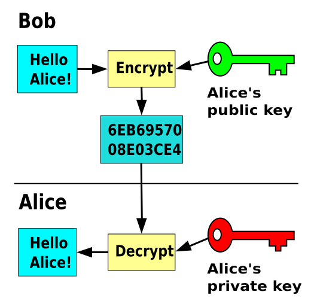
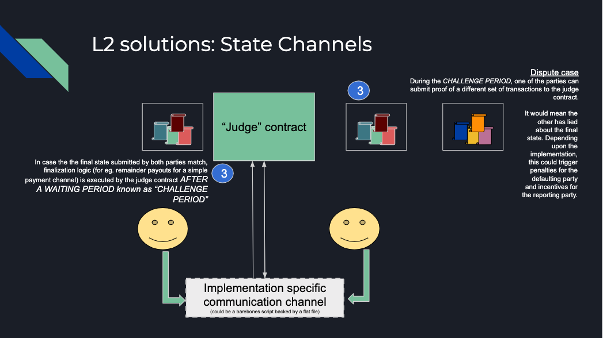

## Prerequisites
It is absolutely critical that you would have gone through at least one of our onboarding guides that will teach you the way MaticVigil handles user accounts, signing up, logging in, deploying contracts etc.

If you haven't, go check them out.
* [Getting started with the CLI tool](cli_gettingstarted.md)
* [Getting started with the Web UI](web_gettingstarted.md)

While you are at it, you might also want to check out [working with an ERC20 contract.](erc20_example.md)

## Basics

The Ethereum platform comes batteries included with primitives that allow cryptographic signing and verification of messages. 'Messages' can be any form of data, the structure of which is agreed upon in both the signing and verifying logic.

### Asymmetric/Public Key cryptography

'Key' points

- You have  a public and a private key. Public key can be distributed, well, publicly. Private, you keep it, private.

- The two keys are mathematically related.


- You can generate an encrypted version of a piece of data on signing it with your private key. Others can verify i.e. decrypt it with your public key.

- Others can use your public key to sign a piece of data only intended for you. You can decrypt the same with your private key.

- The encryption algorithms make use of one-way functions -- mathematical functions that are
    - computationally cheap to execute to arrive at an output given two inputs
    - but computationally expensive by many orders to arrive at an expected set of inputs given an output



### Further reading

- [Wikipedia - public key cryptography](https://en.wikipedia.org/wiki/Public-key_cryptography)
- [Reddit - What is the encryption algorithm used by Ethereum and how does it work?
](https://www.reddit.com/r/ethereum/comments/81e7f9/what_is_the_encryption_algorithm_used_by_ethereum/)


### Applications of signing and verifying of messages

- Any use case which involves the blockchain being used to store proofs of computations/ business process lifecycle changes that are executed 'off-chain' to save transaction costs
    - State channels - submit proofs of settlements, challenges and verify the same to move the transaction lifecycle forward.

    - decentralized exchanges - orders take place on a network/chain/database separate from the main chain. As with state channels, the chain is used for settlement.   

    - [Ethereum Meta Transactions](https://medium.com/@austin_48503/ethereum-meta-transactions-90ccf0859e84)


>The signing and verification of data is purely computational and does not require any form of connection to the Ethereum networks.



## Creating the signature

### How is the signature computed?

Take a look at the [`eth_sign` method](https://github.com/ethereum/wiki/wiki/JSON-RPC#eth_sign) exposed by the JSON-RPC interface of Ethereum clients. The same is also available through other client libraries such as `web3.js` , `web3.py` etc.

>The sign method calculates an Ethereum specific signature with: `sign(keccak256("\x19Ethereum Signed Message:\n" + len(message) + message)))`
>
> By adding a prefix to the message makes the calculated signature recognisable as an Ethereum specific signature. This prevents misuse where a malicious DApp can sign arbitrary data (e.g. transaction) and use the signature to impersonate the victim.

### Formalizing the message to be signed

The `message` noted above need not be only a string.

For this walkthrough, we have decided upon a unique identifier/counter packed with the address of the verifying contract. This is the smart contract method where the signed data is submitted.

```
function submitConfirmation(uint256 uniqueID, bytes memory sig)
public {
    bytes32 message = prefixed(keccak256(abi.encodePacked(uniqueID, address(this))));
    address signer = recoverSigner(message, sig);
    emit ConfirmationSigRecieved(uniqueID, signer);
}
```

We will get to `recoverSigner` in a bit.
We are generating the signature from a constructed `message` as described in the section [How is the signature computed?](eth_sign.md#how-is-the-signature-computed)

1. Do a packed encoding of the individual data fields that make up the message. `uniqueID` and `address(this`) i.e. the address of the verifying contract.
    - each data field is encoded according to a hexadecimal representation according to the [encoding rules laid out in the formal spec](https://solidity.readthedocs.io/en/develop/abi-spec.html#formal-specification-of-the-encoding)

    - `abi.encodePacked()` is available in Solidity that 'mashes' all the encoded values without any extra paddings. [From the docs](https://solidity.readthedocs.io/en/develop/abi-spec.html#formal-specification-of-the-encoding),
        - types shorter than 32 bytes are neither zero padded nor sign extended
        - dynamic types are encoded in-place and without the length
        - array elements are padded, but still encoded in-place

2. Do a `keccak256` hash of the above packed data. This will always generate a message that is 32-bytes/256-bits long.
```
keccak256(abi.encodePacked(uniqueID, address(this)))
```

3. `prefixed()` generates the Ethereum specific signature

```
// Builds a prefixed hash to mimic the behavior of eth_sign.
function prefixed(bytes32 hash) internal pure returns (bytes32) {
    return keccak256(abi.encodePacked("\x19Ethereum Signed Message:\n32", hash));
}
```

We have replaced `len(message)` with 32 since it is already known that a `keccak256()` always returns a value that is 32-bytes long.

### Recovering the message signer in the smart contract

ECDSA signatures in Ethereum consist of three parameters: `v`, `r` and `s`. The signature is always 65-bytes in length.

- `r` = first 32 bytes of signature
- `s` = second 32 bytes of signature
- `v` = final 1 byte of signature

`ecrecover(bytes32 hash, uint8 v, bytes32 r, bytes32 s) returns (address)`

Solidity has a built-in function `ecrecover()` that accepts
1. the expected `keccak256` hash correspondign to the correct reconstruction of the message: `uniqueID + address of verifying contract`
2. the components of the ECDSA signature as described above

and returns the address used to sign the message.


```
function recoverSigner(bytes32 message, bytes memory sig) internal pure
returns (address)
{
    uint8 v;
    bytes32 r;
    bytes32 s;

    (v, r, s) = splitSignature(sig);

    return ecrecover(message, v, r, s);
}

function splitSignature(bytes memory sig)
internal
pure
returns (uint8, bytes32, bytes32)
{
    require(sig.length == 65);

    bytes32 r;
    bytes32 s;
    uint8 v;

    assembly {
        // first 32 bytes, after the length prefix
        r := mload(add(sig, 32))
        // second 32 bytes
        s := mload(add(sig, 64))
        // final byte (first byte of the next 32 bytes)
        v := byte(0, mload(add(sig, 96)))
    }

    return (v, r, s);
}
```

### Why use `uniqueID` and `address(this)` in calculating signature
We want to add as many unique fields in a message that would avoid "replay" attacks.

- `uniqueID`: Assume submitting a confirmation on the string `ReleasePayment:invoice:0x00aabbccddeeff:amount:15000`. The 65-byte signature, if intercepted by a man-in-the-middle, can be resubmitted to the contract and could trigger the same payout function twice.

- `address(this)` : let us the same payout contract code has been deployed on a new address, and the uniqueIDs that would have been recorded on the older contract don't hold valid on the new one any more. Hence, older unique identifiers can be used to re-release the amounts once more.

## Generating signature and submitting to the smart contract

The code snippets can be found in the [github repo](https://github.com/blockvigil/maticvigil-api-usage-examples/tree/master/eth_sign) that includes a command line script.

### Setting up the contract

#### Deploy
```
$ python eth_sign_cli.py deploy
OR
$ ethsign-cli deploy

Contract address was not supplied in configuration
Deployed contract results
{
    'success': True,
    'data': {
        'contract': '0xbfd6eabcb94eb1dea59d8a8a5019699c18681cb0',
        'gas': '145790',
        'txhash': '0x198c9fcf9a0dcd12502e8db78f87ebc53b0e9198ef7f628271ef6081e0d35847',
        'hash': '0x198c9fcf9a0dcd12502e8db78f87ebc53b0e9198ef7f628271ef6081e0d35847'
    }
}

Copy the contract address into settings.json
```

#### Launch the webhook listener that listens on port `5554`. We will tunnel to it through an `ngrok` endpoint that will allow the MaticVigil Mainnet API gateway to deliver event data payloads to our local server.

1. `python webhook_listener.py`

2. `./ngrok http 5554`

Copy the HTTPS forwarding URL, for example, `https://c1c8b4fd.ngrok.io`

>Refer back to the [CLI tool guide](cli_gettingstarted.md#webhooks) or [web UI guide](web_gettingstarted.md#webhooks) to learn how to add webhook integrations on MaticVigil beta

#### Register the webhook listening endpoint with the MaticVigil platform

```
$ python eth_sign_cli.py registerhook https://4c1d746f.ngrok.io

{"success":true,"data":{"id":24}}
Succeeded in registering webhook with MaticVigil API...
MaticVigil Hook ID: 24
```

#### Subscribe to all events emitted from this contract

```
$ python eth_sign_cli.py addhooktoevent 24 '*'

Registering | hook ID: 24 | events: ['*'] | contract: 0xee07ee1a2e1dfbf307de512ce57bd9db7d824755
{"success":true,"subscribedEvents":["*"]}
Succeeded in adding hook
```

### Send a signed message to the contract
The command format is `submitconfirmation <unique sequence ID/nonce> <private key used to sign the message>`
```
$ python eth_sign_cli.py submitconfirmation 1 0x080a12470a639f95139e5e2d9fc7ca597869a42de9bfab4969a3a57a89b0c84a

Signing data with settlementid, contractaddr...
1
0xBFd6eabcB94eB1dEA59d8A8a5019699C18681CB0
Signed message hash: 0xd093bf19f8e5d7526953f63b7721628b95820e94cf42298f97cd4502b61ff392024b4030ee7db3f74690e721289b287583d72ccd8ad297e69c822eb4f1f87c2a1b
{"success": true, "data": [{"txHash": "0x34d95ba2cdfdc4abbcc9b2627a8956c16753023903e14a4a8f0d2cef42a614fe"}]}
```

The public Ethereum address corresponding to the private key `0x080a12470a639f95139e5e2d9fc7ca597869a42de9bfab4969a3a57a89b0c84a` is `0x774246187E1E2205C5920898eEde0945016080Df`

```python
import requests

signed_specific_msg = sign_confirmation(uniqueid, contract_address, private_key)
method_args = {
    'uniqueID': uniqueid,
    'sig': signed_specific_msg
}
headers = {'accept': 'application/json', 'Content-Type': 'application/json', 'X-API-KEY': api_key}
method_api_endpoint = f'https://mainnet-api.maticvigil.com/v0.1/contract/0xbfd6eabcb94eb1dea59d8a8a5019699c18681cb0/submitConfirmation'
r = requests.post(url=method_api_endpoint, json=method_args, headers=headers)
print(r.text)

def sign_confirmation(unique_id, contractaddr, private_key):
    print('Signing data with settlementid, contractaddr...')
    print(unique_id)
    print(contractaddr)
    hash = solidityKeccak(abi_types=['uint256', 'address'], values=[unique_id, contractaddr], validity_check=True)
    msg_hash = defunct_hash_message(hexstr=hash.hex())
    signed_msg_hash = Account.signHash(msg_hash, private_key)
    click.echo(f'Signed message hash: {signed_msg_hash.signature.hex()}')
    # return bytes.fromhex(s=signed_msg_hash.signature.hex())
    return signed_msg_hash.signature.hex()

def solidityKeccak(abi_types, values, validity_check=False):
    """
    Executes keccak256 exactly as Solidity does.
    Takes list of abi_types as inputs -- `[uint24, int8[], bool]`
    and list of corresponding values  -- `[20, [-1, 5, 0], True]`

    Adapted from web3.py
    """
    if len(abi_types) != len(values):
        raise ValueError(
            "Length mismatch between provided abi types and values.  Got "
            "{0} types and {1} values.".format(len(abi_types), len(values))
        )
    if validity_check:
        for t, v in zip(abi_types, values):
            if not is_encodable(t, v):
                print(f'Value {v} is not encodable for ABI type {t}')
                return False
    hex_string = eth_utils.add_0x_prefix(''.join(
        encode_single_packed(abi_type, value).hex()
        for abi_type, value
        in zip(abi_types, values)
    ))
    # hex_string = encode_abi_packed(abi_types, values).hex()
    return eth_utils.keccak(hexstr=hex_string)
```

### Verify if the recovered signer address on the contract is the same as expected

The webhook listening endpoint receives the following update

```
========New event received========

ConfirmationSigRecieved

---JSON Payload delivered-----

{
    'txHash': '0x34d95ba2cdfdc4abbcc9b2627a8956c16753023903e14a4a8f0d2cef42a614fe',
    'logIndex': 1,
    'blockNumber': 1303866,
    'transactionIndex': 0,
    'contract': '0xbfd6eabcb94eb1dea59d8a8a5019699c18681cb0',
    'event_name': 'ConfirmationSigRecieved',
    'event_data':
        {'signer': '0x774246187e1e2205c5920898eede0945016080df', 'uniqueID': 1},
    'maticvigil_event_id': 104,
    'ctime': 1568576475
}
```

As expected, the retrieved signer in the event data is the same: `0x774246187e1e2205c5920898eede0945016080df`
