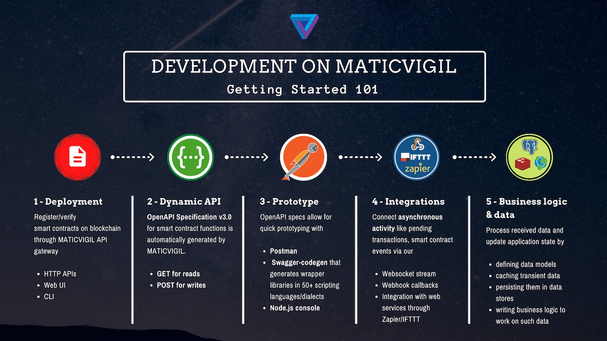

MaticVigil is an API gateway on top of the [Matic.network](https://matic.network) EVM-compatible sidechain. It enables a developer to write code to interact with value transfers and transactions on Matic as if it were talking to just another web service REST API over HTTP.

* You can focus on coding "business logic" without worrying about the "protocol logic" behind the scenes.

* Rely on our in-built caching, monitoring and fault-tolerant logic that powers the API.

* Configure further integrations with webservices (Webhooks/IFTTT applets/Websockets), email, slack and many more over smart contract events and specific Ethereum transactions, powered by our monitoring and watcher systems.

# Why MaticVigil

MaticVigil takes care of the heavy lifting needed to conform with protocol specific logic like:

* private key management, upgradeable contracts, proxy patterns
* transaction lifecycle management
* Gas limits and transaction fees, execution optimization etc.
* Correct encoding and decoding of transaction data

This allows developers to quickly deploy and build on smart contracts over MaticVigil API gateway with minimal knowledge of the Ethereum Virtual Machine or Solidity, usually reducing the lifecycle of blockchain application development by a factor of 80%.

The API gateway is **not a mere relay** that maps HTTP API calls to blockchain protocol commands but rather, **a state machine** that attempts to stay as close to the globally accepted version of chain of blocks.

# Learning and hacking resources

Matic is a EVM compatible chain, hence most of our guides and other content in the domain of Ethereum development applies here as well.

* [Engineering blog | Medium](https://medium.com/blockvigil)
  * [Ethvigil — API gateway for Ethereum | a 10,000 ft overview](https://medium.com/blockvigil/ethvigil-api-gateway-for-ethereum-b9d5266f2ea6)
  * [Design pattern of developing Ethereum applications on Ethvigil API gateway](https://medium.com/blockvigil/design-pattern-of-developing-ethereum-applications-on-ethvigil-api-gateway-b56337b0086a)

* [Ethereum Tutorials](https://tutorials.ethvigil.com) — Live, interactive, hands-on tutorials running on the Ethereum blockchain (Goerli testnet)

# Reach out to us

* [Join our discord server](https://discord.gg/5GGVJyM). This is where we can be found most of the time and is the best place for technical discussions. Want to discuss blockchain protocols? Facing issues or doubts about integrating our APIs into a blockchain app? Shoot us a message!

* You can raise Issues [on our github repos](https://github.com/blockvigil) if you face trouble using our CLI or following any of the API usage examples.

* [Follow us on twitter](https://twitter.com/blockvigil) to get updates on our latest code releases, development guides, upcoming meetups and webinars.

* Any other questions? Email us at hello@blockvigil.com

* Don't forget to sign up for your MaticVigil Mainnet account at https://mainnet.maticvigil.com
