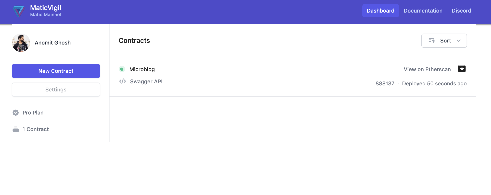
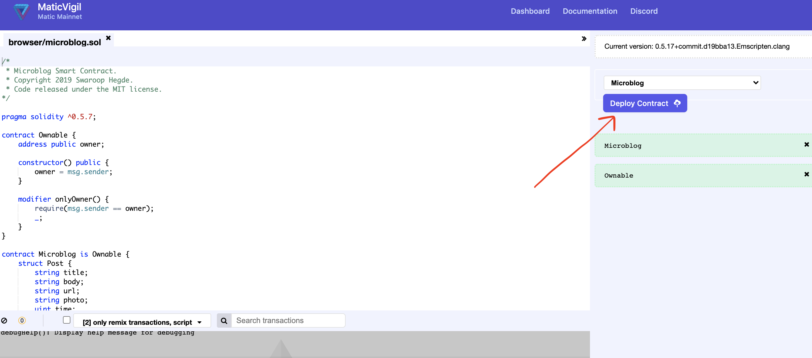
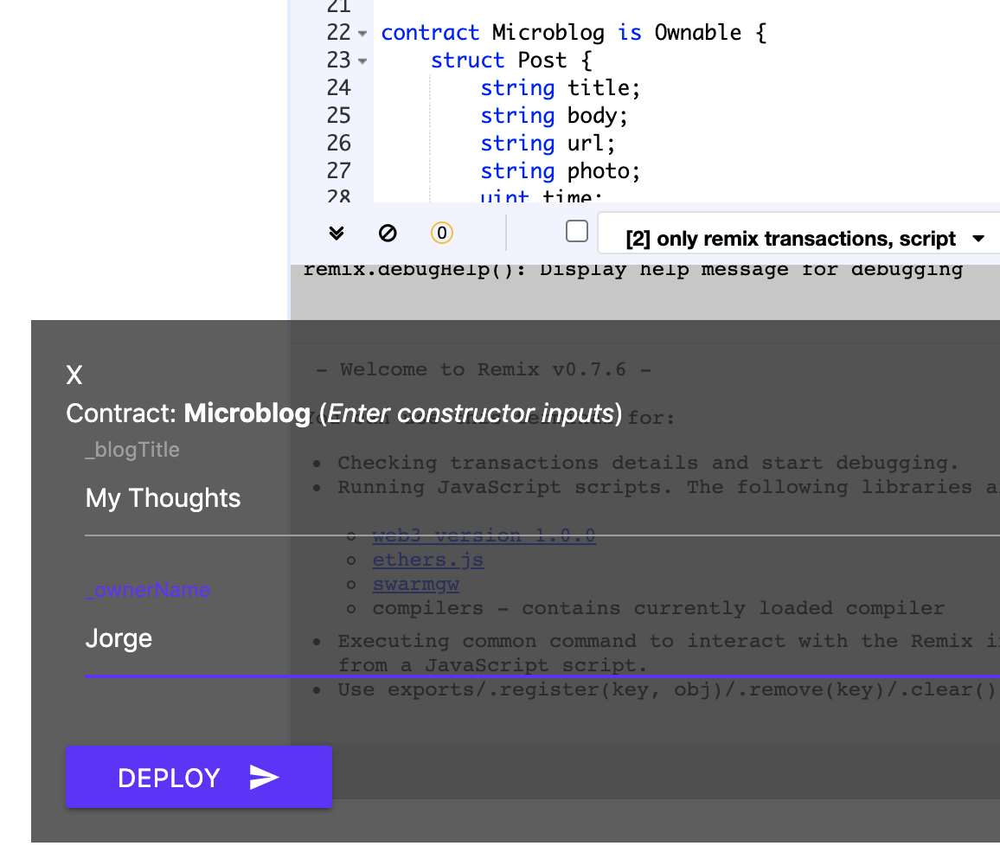
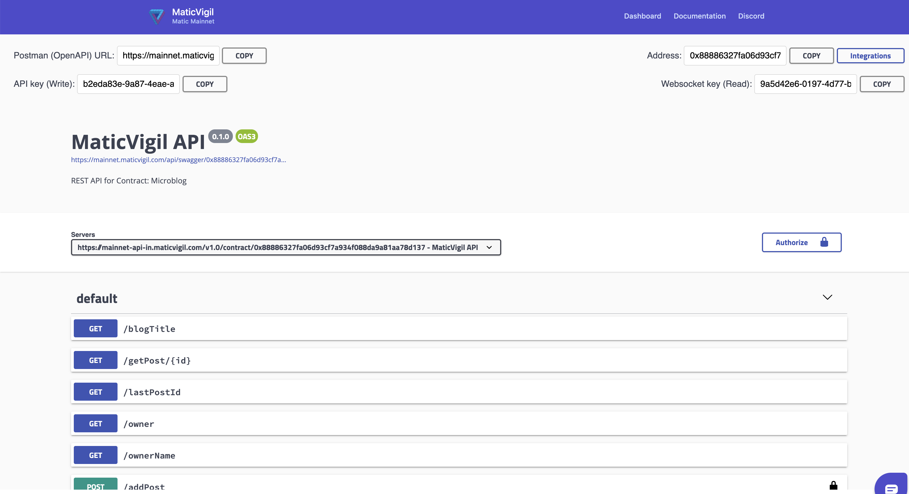
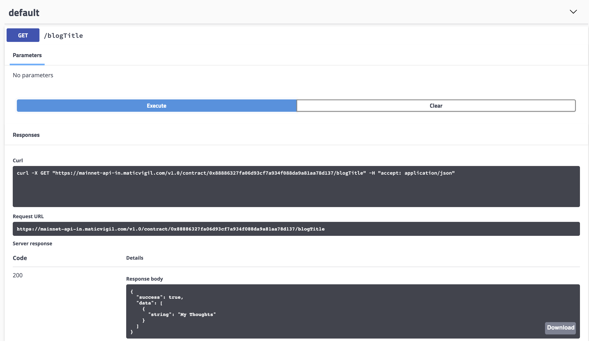
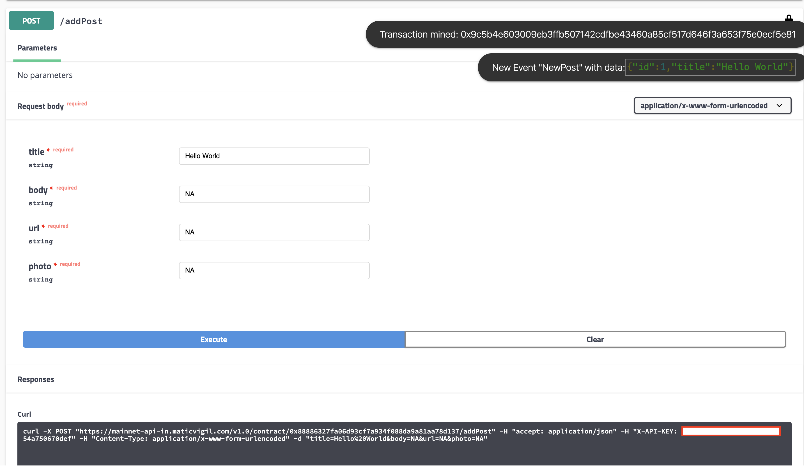
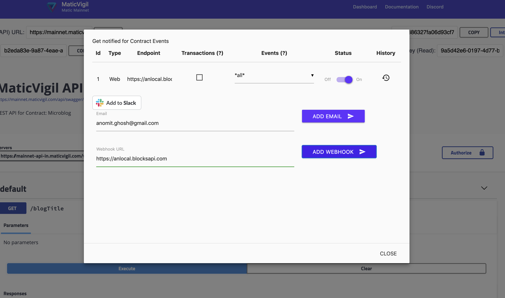
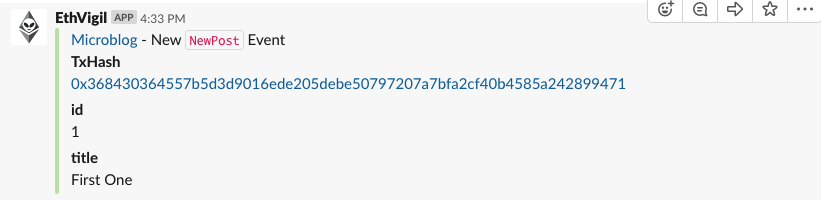

The guide will introduce you to the MaticVigil API endpoints with the help of a Web UI that abstracts away the underlying HTTP requests:
* sign up using your exclusive MaticVigil invite code
* deploy a Solidity smart contract
* access the Solidity smart contract using REST APIs
* setup webhooks to monitor transactions and events

>If you wish to setup the CLI tool, skip this section of the guide to learn how to set it up [⏩ ⏩ Using the CLI tool](cli_gettingstarted.md)

## Sign up with invite code
Head to [MaticVigil Mainnet](https://mainnet.maticvigil.com/) to generate an invite code.

Enter your email, password (to generate a local wallet) and fill the captcha to request an invite. We usually send our invites in waves but if you are participating in hackathons such as ETHGlobal or through our partner networks, you will get one instantly.

>Optionally, we use Metamask to securely manage your account with us. You do NOT need to have any gas on mainnet or testnet – we handle the transaction costs for deployments and contract calls. More on [proxying contract calls](https://medium.com/blockvigil/signer-control-cum-proxy-smart-contract-a-look-at-ethvigils-latest-offering-9ad6c098c095) will be explained later.

On the next prompt you will be asked for your invite code. The invite code should have been sent to the email address you used to register.

Once you are signed up, you'll be taken to a dashboard where you can see all the contracts deployed through MaticVigil.

## Deploy a Solidity smart contract

Head to Remix (or click `New Contract`) to deploy your first smart contract with us. It loads the full Remix IDE, so it make take time on slower connections.

We have preloaded a `MicroBlog` Smart contract. Deploy the contract by clicking the button labelled `Deploy Contract`. You can enter inputs to the contract constructor but we'll cover more about that later. Also, feel free to add your own contract but we highly recommending starting with `MicroBlog` to see the *effortless* deployment and other features!

## Using the REST API

You will now be taken to a `Swagger UI` page which allows you to interact with our REST APIs. Behind the scenes, we generate a powerful OpenAPI 3.0 compatible `json` that you can use in tools such as [Postman](https://www.getpostman.com/).

Try out any of the calls such as `/blogTitle` and see the response without having to *write any code*. You can also take the `curl` example and try it directly in your browser or a terminal

Now, reading from Blockchain may be easy. But ensuring write calls go through with the correct encoding, gas, nonce and transaction itself is complex. We abstract all of that away without you having to even sign with your key. Try `/addPost` and check the transaction hash and the events generated.

*🍪 Brownie points for those who noticed the little websocket notifications about the transaction getting mined and the event being emitted 🎉*

## Adding integrations

On the top right corner of the dashboard of a contract, you can find a button to add integrations like webhooks/email notifications/slack notifications.

* You can monitor
  * specific/all events being emitted on a contract
  * all transactions taking place on a contract

* You receive the relevant payloads like event topics or transaction input data

### Webhooks

To test webhooks, it is suggested to set up a webhook listener on a service like https://webhook.site
>MaticVigil supports only HTTPS enabled webhook endpoints

By default, we subscribe you to all events but you can chose one or more such as `New Post`. You may also subscribe to raw transaction events.

### Slack

You can similarly setup a Slack integration. We will post all events to a channel of your choice.

