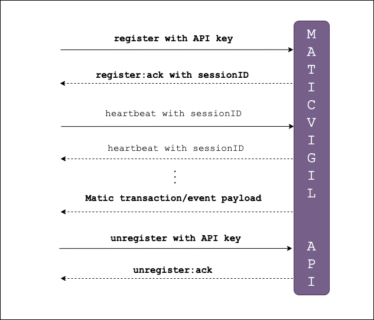

MaticVigil exposes a Websocket API to registered developers that can deliver streaming information on transactions, event logs, contract deployments in real time.

You will need to copy over the API write key from the MaticVigil dashboard. Connect your Websocket client code to the endpoint `wss://mainnet.maticvigil.com/ws`

## State transitions

1. Client connects with API key

  1.1. If API key is valid, an acknowledgement is returned by server along with a sessionID

  1.2. If not, a non-acknowledgement(NACK) is sent. Go to 7.
2. Client sends a periodic heartbeat (say every 15 seconds) along with the authenticated sessionID
3. Server responds to heartbeats for authenticated sessionID
4. Server pushes payloads to client corresponding to contract deployments, transaction acitivity on contracts and emitted event logs
5. Client can send a disconnect request with API key
6. Disconnection is acknowledged by server
7. Connection is closed



## Message formats

### Authentication and connection initialization

The client sends a message of the following format. The **read** API key can be found from the CLI by calling `mv-cli accountinfo` or from [MaticVigil Swagger](https://mainnet.maticvigil.com/#swagger) when you open up any contract in there.

```json
{
  "command": "register",
  "key": "<read_api_key>"
}
```

The server responds with an acknowledgement if it is a valid API key.

```json
{
  "command": "register:ack",
  "sessionID": "<session UUID>"
}
```
Else it responds with a non-acknowledgement and disconnects.

```json
{ "command": "register:nack" }
```
### Heartbeat messages to keep a connection alive

The client is expected to send periodic heartbeat messages, say, every 15-30 seconds that also specifies the sessionID returned during connection authentication.

The server responds with the same message.

```json
{
  "command": "heartbeat",
  "sessionID": "<session UUID>"
}
```

### Transaction activity on contracts

Any contracts that you have deployed or retrospectively verified through MaticVigil, are monitored and details of transactions sent to it are delivered to the client.

Such messages can be identified by the `"type": "contractmon"` field.

```json
{
  "type": "contractmon",
  "txHash": "0xd111e22115e33c0ff570003ab021a8e8d4fb6f61b130c0bfd959e995dc162646",
  "fromAddress": "0xa3f36a33e66adeb98e08fe1bd96b4c58517c64c4",
  "input": "encoded hexadecimal representation of input data sent in transaction",
  "inputJSON": {
    "method": {
      "name": "addPost",
      "canonical_signature": "addPost(string,string,string,string)",
      "selector": "4c57e97a",
      "hash": "0x4c57e97a18c1628fbfb2a25a3a647c8436a651a8b5fe081444d3e7e29017806d"
    },
    "input_data": [
      {
        "param_name": "title",
        "param_type": "string",
        "value": "First Post"
      },
      {
        "param_name": "body",
        "param_type": "string",
        "value": "This is my first post"
      },
      {
        "param_name": "url",
        "param_type": "string",
        "value": "https://maticvigil.com"
      },
      {
        "param_name": "photo",
        "param_type": "string",
        "value": "none"
      }
    ]
  },
  "toAddress": "0x882834023bddcdbe7aa4409771c153c749ae6234",
  "gasUsed": 146338,
  "gas": 160971,
  "gasPrice": 5000000000,
  "value": 0,
  "status": 1
}
```

### Event logs

Transactions can also emit event logs. MaticVigil delivers these updates too to authenticated Websocket clients.

Such messages can be identified by the `"type": "event"` field.

```json
{
  "type": "event",
  "txHash": "0xd111e22115e33c0ff570003ab021a8e8d4fb6f61b130c0bfd959e995dc162646",
  "logIndex": 0,
  "blockNumber": 2006331,
  "transactionIndex": 0,
  "contract": "0x882834023bddcdbe7aa4409771c153c749ae6234",
  "event_name": "NewPost",
  "event_data": {
    "id": 2,
    "title": "First Post"
  },
  "maticvigil_event_id": 15,
  "ctime": 1594994252
}
```
### One-time transaction monitoring

These messages are usually automatically delivered on confirmation of contract deployments. We have not yet opened up the registration command to subscribe to these updates.

Such messages can be identified by the `"type": "otm"` field.

```json
{
  "type": "otm",
  "txHash": "0x601317318052812430e55024f069fbfc0a4298f2d7b9a97b5df2d4258756dd0b",
  "fromAddress": "0x281048bf4d3bbbbd38abe184f6b306216b2e06ae",
  "input": "encoded hexadecimal representation of input data sent in transaction",
  "inputJSON": {
    "method": {
      "name": "ContractDeploy"
    },
    "input_data": "encoded hexadecimal representation of input data sent in transaction"
  },
  "toAddress": null,
  "gasUsed": 1327482,
  "gas": 1460230,
  "gasPrice": 10000000000,
  "value": 0,
  "status": 1
}
```

## Example implementations

### Python

You can find an implementation of the client side protocol [in Python in our SDK repository on Github.](https://github.com/blockvigil/maticvigil-python-sdk/blob/master/examples/auditlog/websocket_listener.py).


```python
import json
import websockets
import asyncio
import async_timeout
import queue
import threading
import time

# `update_q` is a thread-safe queue that another thread can consume from
async def consumer_contract(read_api_key, update_q: queue.Queue):
    async with websockets.connect('wss://mainnet.maticvigil.com/ws') as ws:
        await ws.send(json.dumps({'command': 'register', 'key': read_api_key}))
        ack = await ws.recv()
        ack = json.loads(ack)
        try:
            ack_cmd = ack['command']
        except KeyError:
            print('Bad response')
            await ws.close()
            return
        else:
            if ack_cmd != 'register:ack':
                print('Registration not acknowledged')
                await ws.close()
                return
        sessionID = ack['sessionID']
        print('\nReceived Websocket Session ID: ', sessionID)
        while True:
            try:
                async with async_timeout.timeout(10):
                    msg = await ws.recv()
                    if json.loads(msg).get('command') != 'heartbeat':
                        print(msg)
                        update_q.put(msg)
            except asyncio.TimeoutError:
                await ws.send(json.dumps({'command': 'heartbeat', 'sessionID': sessionID}))
                ack = await ws.recv()
                # print(ack)
            except asyncio.CancelledError:
                print('Websocket subscriber task exiting. Sending UNREGISTER...')
                try:
                    await ws.send(json.dumps({'command': 'unregister', 'key': read_api_key}))
                    ack = await ws.recv()
                    await ws.close()
                except:  # ignore any residual shutdown errors
                    pass
                finally:
                    break
```                    


### JavaScript

The following code is meant for client side browser apps to take full advantage of our Websocket API using vanilla JS. It has zero dependencies and can independently run without the need for a backend server. NodeJS users can use a library like `ws` to do something similar on the backend as necessary.

```js
var wsConnection;
var wsTries = 5;
var timeout = 1000;
var wsSessionID;

initWS(''); //pass the read key.

function initWS(key){
	console.log('tries', wsTries);
	if (wsTries <= 0){
		console.error('unable to estabilish WS after 5 tries!');
		wsConnection = null;
		wsTries = 5;
		wsSessionID = null;
		return;
	}
	wsConnection = new WebSocket('wss://mainnet.maticvigil.com/ws');
	wsConnection.onopen = function () {
		wsConnection.send(JSON.stringify({
			'command': 'register',
			'key': key
		}));
	};

	// Log errors
	wsConnection.onerror = function (error) {
		wsTries--;
		console.error('WebSocket Error ', error);
	};

	// Log messages from the server
	wsConnection.onmessage = function (d) {
		try {
			var data = JSON.parse(d.data);
			if (data.command){
			 	if (data.command == 'register:nack'){
					console.error('bad auth from WS');
					closeWS();
				}
				if (data.command == 'register:ack'){
					wsSessionID = data.sessionID;
					console.log('got sessionID', wsSessionID);
					heartbeat();
				}
				return;
			}
			if (data.type){
				if (data.type == 'event'){
					console.log('event', data);
					//now do something with the event.
				} else {
					console.log('tx', data);
					//now do something with the tx data.
				}
				return;
			}
			console.warn('got unrecognized json data', data);
		}
		catch (e){
			console.error('got non json data', d.data, e);
		}
	};
	wsConnection.onclose = function(e){
		console.error('websocket error', e);
		if (e.code != 1000){
			closeWS();
		} else {
			setTimeout(function(){
				initWS(key);
			}, timeout);
		}
	};
}

function closeWS(){
	if (wsConnection){
		console.log('closing ws');
		wsSessionID = null;
		wsConnection.onclose = function(){
			wsConnection = null;
		};
		wsConnection.close();
	}
}

function heartbeat() {
	if (!wsSessionID || !wsConnection || wsConnection.readyState !== 1){
		return;
	}
	wsConnection.send(JSON.stringify({
		command: "heartbeat",
		sessionID: wsSessionID
	}));
	setTimeout(heartbeat, 30000);
}
```
